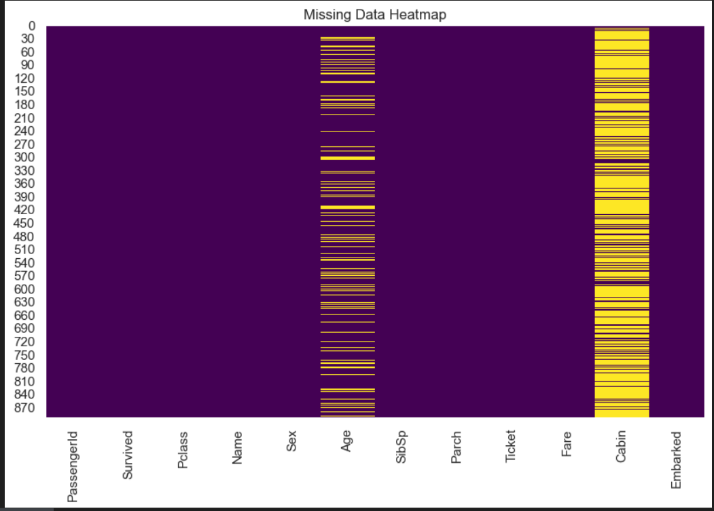
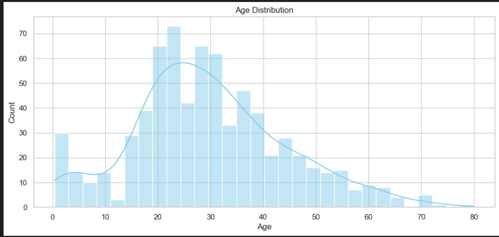

# 🚢 Titanic Dataset - Exploratory Data Analysis (EDA) using Python

This project involves performing **Exploratory Data Analysis (EDA)** on the Titanic dataset using Python. The aim is to uncover insights into what factors influenced the survival of passengers during the Titanic disaster.

## 📂 Dataset

- Source: [Kaggle - Titanic: Machine Learning from Disaster](https://www.kaggle.com/c/titanic/data)
  

## 🛠️ Technologies Used

- **Python**
- **Jupyter Notebook**
- **Pandas** for data manipulation
- **NumPy** for numerical operations
- **Matplotlib** & **Seaborn** for data visualization

## 📌 Key Steps

1. **Data Loading**  
2. **Handling Missing Values**  
3. **Data Cleaning & Preprocessing**  
4. **Univariate & Bivariate Analysis**  
5. **Visualizations using Seaborn and Matplotlib**  
6. **Insight Extraction**

## 📊 Insights Discovered

- Female passengers had significantly higher survival rates.
- Passengers in 1st class were more likely to survive than those in 2nd or 3rd.
- Age and Fare distributions gave insights into the passenger demographics.
- Missing values in the Age and Cabin columns were handled or dropped as needed.

## 📷 Sample Visualizations

  

## 🚀 How to Run

1. Clone this repository
2. Open the Jupyter Notebook (`EDA-checkpoint.ipynb`)
3. Run all cells step-by-step

## 📄 Project Status

✅ Completed basic EDA.  
✨ Could be extended in the future with feature engineering and ML modeling.
 
